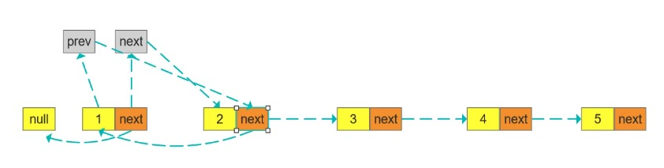

## 链表反转

将单链表的链接顺序反转过来

例如：输入：1->2->3->4->5

输出：5->4->3->2->1

使用两种方式解题



```js
/**
    *
    * @param  head 链表头部
    * @return 返回倒序后的链表头部
    */
public static ListNode iterate(ListNode head){
    ListNode prev=null;
    ListNode next;
    ListNode current = head;
    while (current != null){
        next = current.next;    //保存下一个
        current.next = prev;    //当前连接上一个
        prev = current;         //将上一个后移
        current = next;         //将当前后移
    }
    return prev;
}
```
